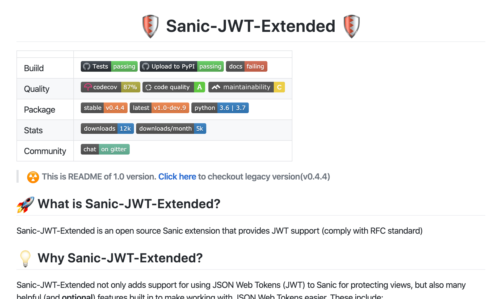
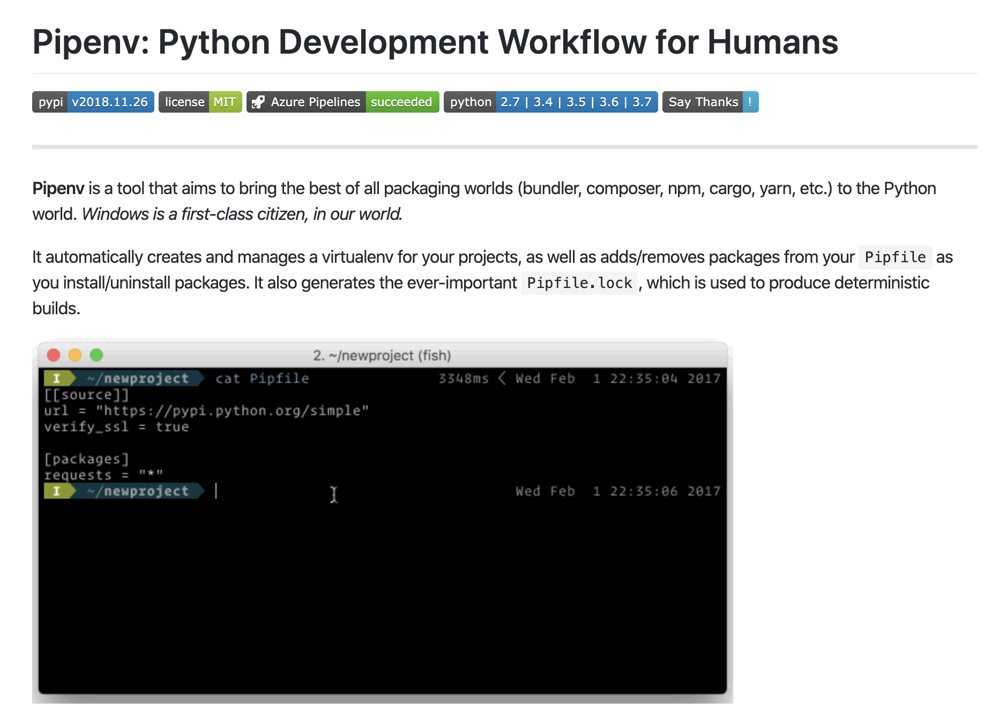
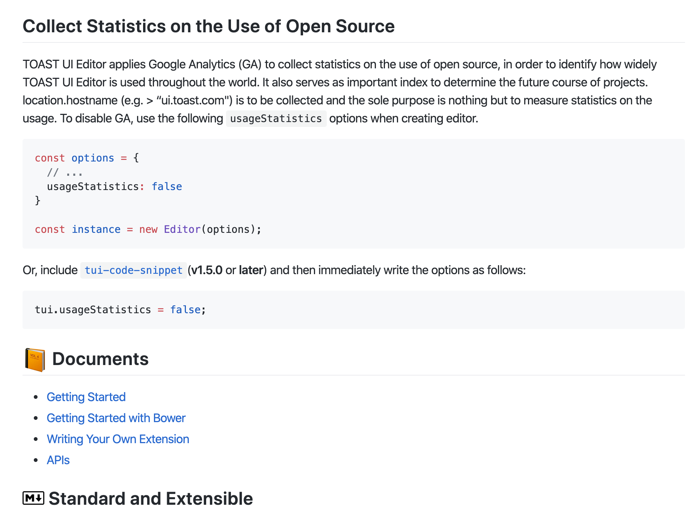

깃허브 속을 탐험하다 보면 많은 프로젝트들이 힙하고 멋진 리드미로 깃허브를 여행하는 히치하이커들을 유혹한다. 그리고 그런 멋진 리드미를 쓰는 법은 크게 어렵지 않다. 다음에서 소개하는 몇가지의 방법만 기억한다면 멋져보이는 리드미를 당신도 만들 수 있다.

# 상단
가장 중요한 것은 상단이다. HTML-in-markdown을 사용해 **가운데 정렬**한 제목과 한줄소개, 그리고 왠지 모를 신뢰성을 주는 **다양한 뱃지**들을 잘 나열하면 반은 먹고 들어갈 수 있다.

1. `# 프로젝트 이름` 가 아닌 `<h1 align="center">프로젝트 이름</h1>`
    - 가운데 정렬은 특히나 뭔가 있어 보이게 하는데 큰 역할을 한다.
2. 가운데 정렬한 프로젝트, 회사 로고 (옵션)
3. 왠지 모를 신뢰감을 주는 뱃지들
    - Travis CI, Circle CI, 또는 GitHub Action에서 제공하는 빌드 스테이터스 뱃지를 사용해 프로젝트가 정상적으로 돌아가고 있다는 안도감을 주자.
    - 코드 커버리지, 코드 퀄리티, maintainability 뱃지를 사용해 프로젝트의 코드가 훌룡하고 안전하다는 인상을 주자.
    - npm 또는 pypi 등지에서 당신의 패키지가 얼마나 다운로드 되었는지를 표시하는 스탯이 어느정도 자랑할만 하다면 그 뱃지도 추가하자.
    - 그 밖에 shields.io에서 원하는 뱃지를 찾아 붙여 보도록 하자.
    - 다만 주의할 점은 과하지 않도록 해야 한다.
4. 한줄소개
    - 한줄소개는 필요하다.
    - 인용문으로 하면 권위있어보인다.

# 본문
효과적인 상단으로 유저의 스크롤을 내리게 했다면 2타로 멋진 본문을 준비해야 한다. 이것은 당신의 프로젝트가 어떤 프로젝트이냐에 따라 조금 갈리게 된다.

일단 기본적으로 사용자가 떠나지 않도록 인스톨하는 방법과 사용하는 방법 등은 당연히 필요하다. 또한 구현된 기능 또는 로드맵에 대한 소개도 좋다. 사실 솔직히 말하면 사용자가 생각할 필요가 적어지면 적어질 수록 좋다.

1. 목차
    - 아무 내용 없이 스크롤을 늘릴 수 있다. 사용자가 조금 편해 진다.
2. 스크린샷과 코드 예제
    - 일단 당신의 프로젝트가 뭔가를 출력한다면 실행되는 화면으로 GIF를 만들어 상단에 박아넣자. 사용자는 그것에 시선이 집중될 것이다. 그러지 않고 당신의 프로젝트가 라이브러리나 프레임워크 등이라먄 아주 간단한 예제를 만들어 넣도록 하자.
    - 내용 중간중간에 사진을 많이 넣으면 심심한게 덜해진다.
    - 사용자는 사실 글을 별로 읽지 않는다, 복붙하면 돌아가는 코드 예제를 넣자.
3. 이모지
    - 이모지는 당신의 리드미를 화려하게 한다. h1 에서 h3 정도의 헤딩 앞에 이모지를 넣어보자. 👻
4. 좀더 본격적인 도큐먼트/또는 라이브 데모로 안내하는 버튼
    - 사용자는 클릭할 것이다.
    - 주의할 점이 있다면 GitHub MD에서 HTML 버튼은 동작하지 않는다. 고화질의 버튼 이미지를 만들어 링크를 걸자.
5. 누가 쓰는가
    - Used by 탭은 신빙성을 더하는데 아주 효과적이다.
6. FAQ
    - 사용자가 구글 검색을 할 필요성을 덜어줄 수 있다.

# 하단
이제 조금 재미 없는 내용을 써도 된다. 아마 여기까지 내랴온 사용자는 높은 확률로 낚인 것이다. 이쪽에 들어와야 할 내용은 이곳에 컨트리뷰션하기 등에 관한 내용이다.

다음의 내용들을 이곳에 배치하자
- 라이선스
- 컨트리뷰션 가이드
- 기타 정보

# 참고
https://github.com/matiassingers/awesome-readme

