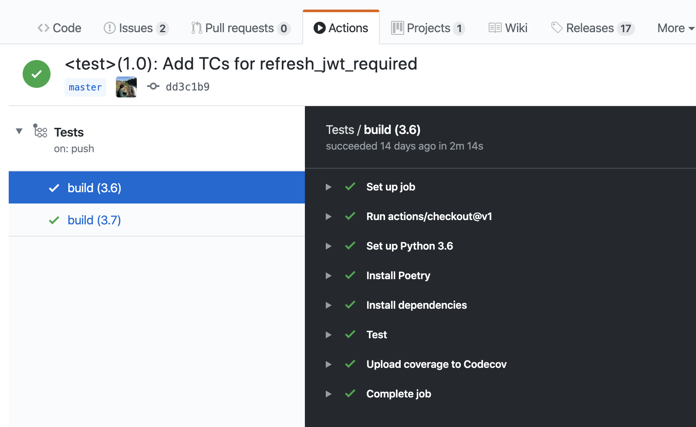
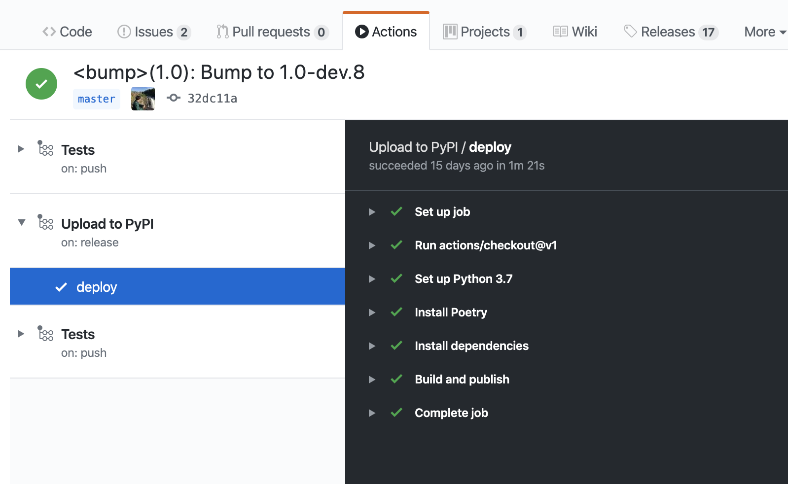

[Sanic-JWT-Extended](https://github.com/NovemberOscar/Sanic-JWT-Extended)를 만들며 처음으로 Poetry와 GitHub Action을 도입해 보았고 굉장히 감동받아 Poetry와 GitHub Action을 소개해 보려고 합니다.

# 왜 Poetry를 쓰나요?

Poetry는  Javascript의 npm과 yarn 처럼 의존성과 패키지 관리를 동시에 수행합니다. Poetry는 필요한 패키지 간의 의존성을 자동으로 풀어내고, 의존성 트리를 lock 파일에 저장함으로써 의존성이 꼬이는 문제를 막아줍니다. 물론 여기까지는 Pipenv도 충분히 할 수 있습니다. 

하지만 Poetry는 의존성-패키지 관리자의 역할 뿐만 아니라 나아가 기존에는 setuptools의 영역이던 프로젝트를 관리할 수 있는 기능을 포함하고 있습니다.

> Poetry is a tool for dependency management and packaging in Python. 

기존에는 setuptools를 사용해 프로젝트를 관리하고, dependency resolving이 필요하다면 Pipenv를 사용하고, 만든 프로젝트를 pypi에 올리기 위해선 twine이란 도구를 써야 하는 등 하나의 파이썬 프로젝트를 괸리하기 위해 서로 설정을 공유할 수 없는 여러가지 툴들을 사용해야 했습니다.

하지만 Poetry는 `pyproject.toml`이란 파일을 통해 의존성, 패키지, 그리고 프로젝트를 한곳에서 관리합니다. 

이 파일을 통해 프로젝트를 정의했다면 이제는 간단히 `poetry install` 이란 명령어를 사용해 패키지를 설치할 수 있고 `poetry build`란 명령어를 사용해 wheel과 sdist를 모두 만들어 낼 수 있으며 `poetry publish`란 명령어를 통해 pypi든 사설 패키지 저장소든 상관없이 업로드할 수 있습니다. 

그리고 이 모든 것을 위해선 단지 Poetry 하나만 설치하면 됩니다.

```toml
[tool.poetry]
name = "Sanic-JWT-Extended"
version = "1.0-dev.9"
description = "Extended JWT integration with Sanic"
authors = [
    "Seonghyeon Kim <kim@seonghyeon.dev>"
]
license = "MIT"
readme = "README.md"
repository = "https://github.com/NovemberOscar/Sanic-JWT-Extended"
documentation = "https://sanic-jwt-extended.seonghyeon.dev/"
keywords = ["sanic", "jwt", "json web token"]
classifiers=[...]

[tool.poetry.dependencies]
# 생략

[tool.poetry.dev-dependencies]
# 생략

[build-system]
requires = ["poetry>=0.12"]
build-backend = "poetry.masonry.api"
```

# 왜 GitHub Action을 쓰나요?

기존에는 CI를 사용하려면 Circle CI, Travis CI 등등의 외부 서비스를 사용해서 테스트와 코드 체크를 수행했습니다. 하지만 GitHub Action이 출시되었고. 외부 서비스에게 전쟁을 선포했습니다.


당연하게도 기존에 다른 서비스들이 제공하던 것처럼 PR과 push에 연결되어 테스트를 수행할 수 있습니다.

추가적으로 여러가지의 환경에서 테스트를 돌릴 수도 있으며, 단계를 구분할 수도 있고, 다른사람들이 만든 액션을 가져다가 사용할 수도 있습니다



아래의 GitHub Action workflow은 다음의 내용들을 수행합니다.
- 파이썬 3.6과 3.7 환경에서 테스트를 수행
- poetry를 설치하고 설치된 poetry를 사용해 패키지 설치
- 테스트를 수행하고 커버리지 추출
- 만들어진 커버리지 리포트를 codecov에 업로드

```yaml
name: Tests

on: [push, pull_request]

jobs:
  build:
    runs-on: ubuntu-latest
    strategy:
      max-parallel: 4
      matrix:
        python-version: [3.6, 3.7]

    steps:
    - uses: actions/checkout@v1
    - name: Set up Python ${{ matrix.python-version }}
      uses: actions/setup-python@v1
      with:
        python-version: ${{ matrix.python-version }}
    - name: Install Poetry
      run: |
        curl -sSL https://raw.githubusercontent.com/sdispater/poetry/master/get-poetry.py | python
        source $HOME/.poetry/env
    - name: Install dependencies
      run: |
        source $HOME/.poetry/env
        poetry install
    - name: Test
      run: |
        source $HOME/.poetry/env
        poetry run pytest --cov=sanic_jwt_extended tests/ --cov-report=xml
    - name: Upload coverage to Codecov  
      uses: codecov/codecov-action@v1
      with: 
        token: ${{ secrets.CODECOV_TOKEN }}
        file: ./coverage.xml
        flags: unittests

```

추가적으로 GitHub 내부 서비스 답게 GitHub Action은 repository 내부에서 일어나는 활동에 트리거되어 동작할 수 있습니다. 

액션을 트리거할 수 있는 이벤트는 많지만 그중에서 특히 유용한 이벤트는 릴리즈 이벤트입니다. 깃허브의 릴리즈 기능을 사용하면 자동으로 실행되어 PyPI에 패키지를 빌드해 업로드하는 액션을 만들 수도 있습니다.




아래의 GitHub Action workflow은 다음의 내용들을 수행합니다.
- 릴리즈가 생성될 때 동작
- poetry를 설치하고 패키지 설치
- GitHub secret에 저장된 값을 사용해 pypi 계정 정보를 세팅
- PyPI에 패키지를 빌드한 후 업로드

```yaml
name: Upload to PyPI

on:
  release:
    types: [created]

jobs:
  deploy:
    runs-on: ubuntu-latest

    steps:
    - uses: actions/checkout@v1
    - name: Set up Python 3.7
      uses: actions/setup-python@v1
      with:
        python-version: '3.7'
    - name: Install Poetry
      run: |
        curl -sSL https://raw.githubusercontent.com/sdispater/poetry/master/get-poetry.py | python
        source $HOME/.poetry/env
    - name: Install dependencies
      run: |
        source $HOME/.poetry/env
        poetry install
    - name: Build and publish
      run: |
        source $HOME/.poetry/env
        poetry config http-basic.pypi ${{ secrets.PYPI_USERNAME }} ${{ secrets.PYPI_PASSWORD }}
        poetry publish --build

```

# 그래서 우리가 뭘 한거죠?

- setuptools, twine, pipenv를 마음속에 묻고 poetry와 새출발
    - 관리 포인트가 줄고 CI 과정도 단순해짐
    - 다만 GitHub가 pyproject.toml 형식을 인식 못해서 내 패키지를 누가 쓰는가와 내가 뭘 쓰는지 알려주는 기능을 사용할 수 없음
- Travis CI등 외부 CI를 걷어내고 GitHub Action 도입
    - 자동으로 PR과 push에 반응해 테스트 수행
- 자동화!
    - 릴리즈를 만들면 자동으로 해당하는 릴리즈를 빌드해 pypi에 업로드