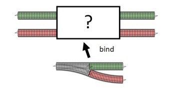

간단한 서버 프로그램을 생각해 봅시다. 사용자로부터 입력을 받고,  입력받은 데이터를 가지고 무언가 IO를 한 후 결과물에  무언가 처리를 해 돌려주는 것이 일반적인 서버의 로직입니다. 

하지만 현실 세계에서는 글로 보듯이 선형적인 흐름이 이루어지지 않습니다. 악의적인 사용자로부터 위험한 입력이 들어올 수도 있고, 비가 와서 인터넷이 느려서 IO가 실패할수도 있고, 결과물이 이상해서 처리를 할 수 없을때도 있습니다. 

그러면 우리는 코드에 try-catch와 if-else를 덕지덕지 발라서 해결하고, 함수의 합성으로 이루어지는 아름다운 코드의 이상은 시궁창에 처박힙니다.

## Railway Oriented Programming




Railway Oriented Programming 은 이 문제를 해결할 완벽한 해결책처럼 보입니다.

ROP는 성공하면 계속 성공한 트랙으로, 실패하면 실패한 트랙으로, 성공하다 실패하면 실패한 트랙으로 진행시키기 위해 `(A) -> M<B>` 꼴을 가지는 1트랙 -> 2트랙 함수들을 flatMap 또는 bind를 통해 `M<A> -> M<B>`  꼴을 가지는 2트랙 -> 2트랙 함수들로 바인딩한 후 바인딩된 함수들을 합성하는 디자인 패턴입니다.

ROP를 적용해 `(A) -> Result<B, C>` 꼴을 가지는 함수들을 bind를 통해 연결했더니 깔끔하게 함수가 합성되는 것을 볼 수 있습니다.  

```python
def check_url(url: str) -> Result[str, ErrorEnum]: ...

def download_url(url: str) -> Result[aiohttp.ClientResponse, ErrorEnum]: ...

def validate_http_response(res: aiohttp.ClientResponse) -> Result[Dict[Any, Any], ErrorEnum]: ...

def download_valid_url_and_validate(url: str) -> Result[Dict[Any, Any], ErrorEnum]:
    return (Result(check_url(url))
        	   .bind(download_url)
        	   .bind(validate_http_response))
```

## AsyncIO?
서버의 리소스를 효과적으로 사용하기 위해 asyncio를 도입하기로 결정했습니다. (이유는 저한테 묻지 마세요 🤫)

```python
def check_url(url: str) -> Result[str, ErrorEnum]: ...

def download_url(url: str) -> Future[Result[aiohttp.ClientResponse, ErrorEnum]]: ...
     async def fn() -> Result[aiohttp.ClientResponse, ErrorEnum] ...
     return Future(fn())

def validate_http_response(res: aiohttp.ClientResponse) -> Future[Result[Dict[Any, Any], ErrorEnum]]: 
     async def fn() -> Result[Dict[Any, Any], ErrorEnum] ...
     return Future(fn())
 
async def download_valid_url_and_validate(url: str) -> Result[Dict[Any, Any], ErrorEnum]:
    ?????
```

무언가 어긋나기 시작합니다 동일한 모나드여야 체이닝이 이루어질텐데 `Result<A, B>`를 반환하는 함수는 `Future<Result<A, B>>`를 반환하는 함수들과 연결시킬 수 없습니다.

### 잠깐만, 모나드라구요? 
네, ROP는 모나드를 사용합니다. 모나드는 포장된 값을 반환하는 함수에 포장된 값을 적용합니다. 즉 `M<A> -> ((A) -> M<B>) -> M<B>` 인데 ROP에서 1트랙 -> 2트랙 함수들을 2트랙 -> 2트랙 함수로 바꿔주는 바로 그 flatMap, 또는 bind 입니다. (아주 엄밀하게는 아니지만 그냥 대충 그렇다고 넘어갑시다.)

아무튼 지금 트랙이 맞지 않는 상황입니다. 이대로라면 기차는 탈선하고, 9시 뉴스에 나올겁니다. 어떻게 해야할까요? 

## Monad Transformer?
Future또는 Result같이 한가지만 사용할 경우에는 아무런 문제가 없습니다. 하지만 우리가 가진 타입은 `Future<Result<A, B>>` 입니다. 

물론 하나정도는 봐줄만합니다

```python
def check_url(url: str) -> Result[str, ErrorEnum]: ...

def download_url(url: str) -> Future[Result[aiohttp.ClientResponse, ErrorEnum]]: ...

async def download_valid_url(url: str) -> Result[aiohttp.ClientResponse, ErrorEnum]:
    return await Future.pure(check_url(url)).bind(
         lambda r: download_url(r.value) if isinstance(r, Ok) else Future.pure(r.err)
    )
```

하지만 트랙의 길이가 늘어난다면 어떻게 될까요?

```python
def check_url(url: str) -> Result[str, ErrorEnum]: ...

def download_url(url: str) -> Future[Result[aiohttp.ClientResponse, ErrorEnum]]: ...

def validate_http_response(res: aiohttp.ClientResponse) -> Future[Result[Dict[Any, Any], ErrorEnum]]: ...

async def download_and_print(url: str) -> Result[aiohttp.ClientResponse, ErrorEnum]:
    return (
        await Future.pure(check_url(url))
        .bind(lambda r: download_url(r.value) if isinstance(r, Ok) else Future.pure(r.err))
        .bind(lambda r: validate_http_response(r.value) if isinstance(r, Ok) else Future.pure(r.err))
        .map(lambda r: r.map(pprint).mapError(print))
    )
```

> 람다가 너어어무 길어요!

bind 안의 람다들은 Future로 감싸진 Result를 처리하기 위한 코드입니다.

```python
lambda r: funcReturnsFut(r.value) if isinstance(r, Ok) else Future.pure(r)
```

그런데 모든 bind마다 해당 람다들이 반복되기 때문에 여기서 우리는 중복을 줄일 수 있는 가능성이 볼 수 있습니다. 이걸 자동으로 수행하는 wrapper를 만들수 있다면 어떨까요?

### FutureResult[A, B]

아까전의 코드에서 본 Future안에 감싸진 Result를 처리하기 위한 map 과 bind를 옮겨 보면 다음과 같습니다.

```python
class FutureResult(Generic[A, B]):
    def __init__(self, fut_res: Future[Result[A, B]]):
        self.fut_res = fut_res

    def map(self, fn: Callable[[A], Result[C, B]]) -> FutureResult[A, B]:
        return FutureResult(self.fut_res.map(lambda res: res.map(fn)))

    def bind(self, fn: Callable[[A], FutureResult[C, B]]) -> FutureResult[A, B]:
        return FutureResult(
            self.fut_res.bind(lambda r: fn(r.value).fut_res if isinstance(r, Ok) else Future.pure(Err(r.err)))
        )

    def __await__(self):
        return self.fut_res.__await__()
```

이제 아까전의 람다가 덕지덕지 칠해진 코드가 줄어드는것을 볼 수 있습니다.


```python
def check_url(url: str) -> Result[str, ErrorEnum]: ...

def download_url(url: str) -> Future[Result[aiohttp.ClientResponse, ErrorEnum]]: ...

def validate_http_response(res: aiohttp.ClientResponse) -> Future[Result[Dict[Any, Any], ErrorEnum]]: ...

async def download_and_print(url: str) -> None:
    return (
        await FutureResult(Future.pure(check_url(url)))
        .bind(lambda u: FutureResult(download_url(u)))
        .bind(lambda r: FutureResult(validate_http_response(r)))
        .map(pprint)
    )
```

### ResultT[F, A, B]

방금전에 만든 FutureResult는 모나드 트랜스포머의 특수한 케이스, 인스턴스라고 부를 수 있습니다. 하지만 어떤 것이든 감싸진 Result를 자동적으로도 처리할 수 있지 않을까요? 

사실 스칼라같이 Higher Kinded Type을 지원하는 언어에서는 Future로 감싸진 Result 뿐만이 아니라 어떤 모나드로 감싸진 모나드를 풀어낼 수 있는 모나드 트랜스포머들이 존재합니다. (EitherT, OptionT, ...)

단도직입적으로 말하자면 아직까지 파이썬에서 타입-안전한 모나드 트랜스포머를 만드는 것을 불가능합니다. [관련된 이슈](https://github.com/python/typing/issues/548)가 열려있지만 근시일내에 해결될것같다는 생각은 들지 않습니다. (거기다가 원래 이슈를 연 사람이 하스켈로 도망가는 바람에 더욱 지지부진해질것 같아보입니다.)

저는 일단 이에 대한 Hack으로 다음의 방법을 제시해봅니다.

```python
ResultT = {
    <Result를 감쌀수 있는 모나드>: <Result를 감싼 모나드를 풀어내는 방법>
}
```

ResultT 라는 딕셔너리를 이용하는 방법입니다. 이 방법을 활용하면 FutureResult를 사용하는 코드를 다음과 같이 바꿀 수 있습니다.

```python
ResultT = {
    Future: FutureResult
}

...

async def download_valid_url_and_validate(url: str) -> Result[Dict[Any, Any], ErrorEnum]:
    return (
        await ResultT[Future](Future.pure(check_url(url)))
        .bind(lambda u: ResultT[Future](download_url(u)))
        .bind(lambda r: ResultT[Future](validate_http_response(r)))
    )
```

이러면 걷보기에는 ResultT에 제네릭 파라미터로 Future를 주어서 Future에 대한 ResultT를 가져오는것처럼 보이게 됩니다.

 Result를 감싸는 모나드를 처리하는법을 추가하려면 ResultT에 새로운 모나드를 키로, 그 모나드로 감싸진 Result를 풀어내는 방법을 값으로 추가하기만 하면 됩니다.

```python
ResultT = {
    Future: FutureResult
    List: ListResult
}
```

## 예제코드

[NovemberOscar/playground](https://github.com/NovemberOscar/playground/blob/master/python-monad/main.py)

## 참고자료

* [Cats: EitherT - Typelevel.scala](https://typelevel.org/cats/datatypes/eithert.html)
* [Monad Transformers aren’t hard!](https://medium.com/@alexander.zaidel/monad-transformers-arent-hard-23387c7ef4a6)
* [간단한 Monad Transformers 만들어보기](https://sungjk.github.io/2019/01/27/monad-transformers.html)
* [Add Future[A] that helps with async code #274](https://github.com/dry-python/returns/issues/274#issuecomment-619504863)