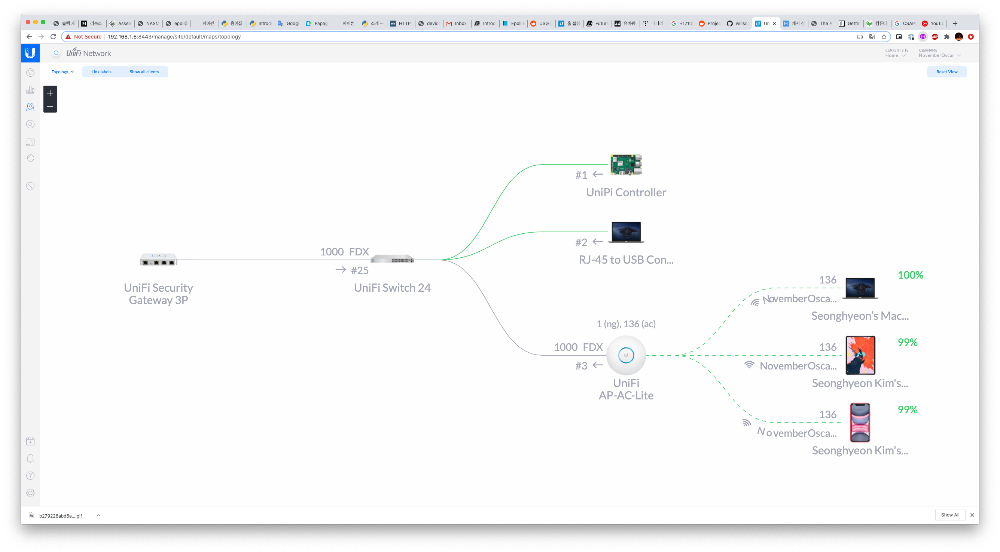

# 왜 유니파이를 쓰는가?

유니파이는 네트워크 장비 회사인 유비쿼티 네트웍스사의 라인업중 하나이다. 컨트롤러를 통한 손쉬운 시스템 구축을 장점으로 미는 라인업으로 다른 라인업으로는 각각의 장비를 개별적으로 설정 가능하고 고급 설정이 가능한 엣지맥스 라인업이 있다. 

아수스, 디링크같은 컨슈머용 제품은 좀 부족하고 그렇다고 시스코 같은건 조금 과하다 생각될 때 유니파이 라인업이 좋은 선택이 될것같다.

사실 나같은 경우에는 평소에도 이런 쪽에 흥미가 많기도 했는데 최근 여러가지 계기로 홈랩과 IoT에 대한 뽐뿌를 많이 받아서 한번 취미로 해보자는 생각에 구매하게 되었다. 

하지만 뽐뿌를 제외하고도 현실적인 측면으로 봐도 시스코나 다른 엔터프라이즈급 보다는 훨씬 저렴한 가격에 비슷한 기능들을 제공하고, 컨슈머용 공유기들처럼 한 장비안에 AP, Switch, Router 등이 모두 들어있는 구성이 아니라 각각 역할별로 장비가 따로 판매되는 직교적인 구성 때문에 필요한 부분만 확장 가능하며 모든 시스템을 편리하지만 그래도 있을 옵션은 다 있는 컨트롤러 소프트웨어로 제어 가능한 점에 있어서 유니파이는 매력적인 선택이 될 것 같다.

또 외국에서도 홈랩 하는 양덕들이 많이 사용하는 브랜드라 커뮤니티도 활발해 쉽게 도움을 얻을 수 있는 점도 좋은 포인트라고 생각한다.

다만 엣지맥스 라인업이 동일하거나 우월한 성능에 가격은 유니파이 제품보다 저렴하기 때문에 자신이 있고 네트워크 성능에 몰빵하고 싶다면 엣지맥스 라인업을 사용하는것도 나쁘지 않을것같다고 생각한다. 

# 네트워크 구성하기

앞서 언급했다시피 유니파이 제품들은 완벽하게 구성하기 위해선 보통 여러가지의 장비를 사야한다. (통합된 제품인 Dream Machine 이란 제품이 출시되었지만 국내 구매는 불가능하다.)

유니파이 제품으로 네트워크를 구성하기 위해서는 역할별로 장비가 분리된 준 기업용같은 세팅을 해야하는데 먼저 네트워크의 심장이 될 라우터, 네트워크를 분배해주는 스위치, WiFi 신호를 뿌려주는 AP, 그리고 이 모든 장비들을 컨트롤할 컨트롤러가 필요하다.

사실 컨트롤러와 라우터 빼고는 타사 장비를 사용해서 손수 셋팅해도 사용에는 큰 지장이 없지만 컨트롤러를 사용해 한번에 컨트롤하는 이점이 크게 사라지기 때문에 유니파이 제품으로 장비를 설정하는 편이 훨씬 속이 편하다.

컨트롤러 기능중에 네트워크 토폴로지를 그려주는 기능이 있는데 유비쿼티 장비만 보여준다. 약간 치사하긴 하지만 이것 때문이라도 유니파이로 시스템을 구성하고 싶은 욕심이 들긴 한다. 

  
  <figcaption>컨트롤러에서 보여지는 토폴로지</figcaption>

## 1차 장비 구성

### USG (Unifi Security Gateway)

  
  <figcaption>Unifi Security Gateway</figcaption>

앞서 말한 장비중에 USG는 라우터 격의 역할을 하는 녀석이다. 라우터 역할을 하는 장비는 여러가지가 있는데 일반적인 사용자가 구매 가능한 제품은 USG, USG-Pro, UDM(Unifi Dream Machine), UDM-Pro 가 있다. 이 중 UDM-Pro는 스위치와 컨트롤러가 포함된 제품으로 훨씬 진보한 제품이지만 국내에는 수입되지 않는 관계로 일반 USG를 택하였다. 하지만 사실 지금 돌이켜 보면 무리를 해서라도 UDM-Pro를 사는게 간지와 정신건강에 훨씬 도움이 되지 않을까.. 싶지만 하단에 서술했다시피 직구가 문제가 좀 있어서 아쉽다. 

가격은 국내에서는 21만원 정도에 구할 수 있으며 포트는 1개의 WAN 포트, 1개의 LAN 포트, 1개의 WAN/LAN 겸용 포트 (필요에 따라 WAN 이중화나 다른 서브넷을 사용하는 LAN을 만들때 사용) 가 있다.

USG는 기본적인 DHCP, NAT, 게이트웨이 기능 외에도 VLAN, VPN, Site-to-Site VPN, DDNS 등등등 다양한 고급 기능을 제공하지만 사실 이것만 있어서는 아무것도 하지 못한다. 왜냐하면 USG라는 녀석은 21만원이란 가격에도 불구하고(…) 컨트롤 소프트웨어가 탑재되어 있지 않기 때문이다. 

### Uni”Pi” Controller

유니파이 시스템의 핵심은 바로 컨트롤러다.  컨트롤러를 사용해서 모든 디바이스를 시스템에 추가하고, 설정 및 관리한다. 장비를 시스템에 추가할때도 랜선만 꽃으면 컨트롤러가 알아서 장비를 찾아서 추가하는 등 유니파이 시스템을 구성하기 위해선 컨트롤러가 반드시 있어야 한다.

사실 컨트롤러 소프트웨어 자체는 무료지만 이 컨트롤러를 편하게 상시 구동하기 위한 “클라우드 키” 라는 장비를 판매중이다. 하지만 어느정도의 리눅스 사용 경험만 있으면 훨씬 저렴한 라즈베리 파이가 비슷하게 컨트롤러 기능을 하도록 구성할 수 있다.

설정 방법은 간단한데 OS로는 Raspbian Lite를 설치하고, ssh 접속해서 몇가지 설정 후 유비쿼티사의 패키지 리스트를 apt의 소스 리스트에 추가하고 컨트롤러를 설치하기만 하면 바로 실행되어서 외부에서 웹브라우저로 바로 접속이 가능하다.

자세한 설치 방법은 [여기](https://lazyadmin.nl/home-network/installing-unifi-controller-on-a-raspberry-pi-in-5-min/)를 참고하자

한번 설정된 이후에는 같은 네트워크에 붙어있지 않더라도 유니파이 사이트에서 원격 접속하는 기능을 제공하기 때문에 모바일 앱등을 사용해 원격으로도 컨트롤이 가능하다.

### AP & Hub

일단은 다른 제품을 구매할 여력이 없었어서, 어디서 얻어온 iptime 허브와 집에 남아돌던 공유기를 써서 구성을 했다. 일단 작동은 했기 때문에 그거에 만족했다.

## 2차 장비 탐색 및 구성

조금 더 총알을 모아서 추가적으로 장비를 구매했다. 구매는 국내의 리셀러인 버프 엔지니어링 사에서 편하게 견적을 받아 구매할 수 있었다. 

### AP-AC-LITE (Access Point)

사실 원래는 직구하면 비슷한 가격으로 구매 가능한 상위 모델인 AP-AC-LR (Long-Range) 모델을 구매하려고 헀으나 국내 전파법 위반 소지가 있기도 하고 국내에서 파는 제품을 사용하지 않으면 지역 이슈가 있다는 경고가 지속적으로 뜬다는 말을 들어서 국내에서 파는 Lite 모델도 견적에 추가해 같이 구매하게 되었다.

  
  <figcaption>AP-AC-LITE</figcaption>

2.4Ghz와 5GHz 밴드를 사용 가능하며 와이파이 신호에 대한 세부적인 조절까지 가능하며 유니파이 브랜드가 Uni”Fi” 인 만큼 유니파이 시스템의 진정한 기능들을 사용할 수 있게 된다.  여러개를 구매해서 설정하면 메쉬 네트워크까지 된다는것 같던데 확인해보진 않았다. 

특이한 점은 유니파이 AP들은 벽이나 천장에 붙여서 사용하는것이 일반적인 거치 방법이기 때문에 PoE(Power over Ethernet)을 사용하여 랜선 한개로 전력과 네트워크를 한번에 연결한다. 

### US-24 (24port Switch)

  
  <figcaption>US-24</figcaption>

이것도 사실 원래 사려던 모델은 아니다. 원래는 2세대 모델인 USW-16-POE 16포트 PoE 스위치를 구매하려고 했으나 국내엔 수입되지 않고 수입이 될지도 불투명한 상황이라 (한국에서 마이너한 제품군이고 하다 보니 기존에 들여온 것들도 안팔리는듯 하다…) 이전 세대의 US-16-150W 제품을 구매하는 것으로 하나 했더니 또 이건 재고가 없어서 상담을 받아 PoE가 없어서 좀더 저렴한 US-24 24포트 스위치를 구매하고 PoE 인젝터를 추가 구매하는것으로 최종 결정했다.  (근데 사실 그 후에 찾아보니 PoE 모델의 소음 이야기가 있어서 안 사길 잘했다는 생각도 들긴 한다.)

US-24 제품은 24개의 기가비트 RJ45 포트와 최대 10기가까지 가능한 2개의 SFP 포트가 있다.  SFP에는  모듈을 장착해야 하는데 모듈에 따라 광섬유를 꽂을수도 있고, 평범한 랜선을 꽃을 수도 있다. (나같은 경우에는 USG로 향하는 업링크를 RJ45 to 어댑터 모듈을 써서 SFP 에 꽂아 사용한다)

유니파이 스위치들은 풀매니지드 스위치이기 때문에 컨트롤러에서 스위치의 포트 하나하나까지 관리가 가능하다. 이 포트를 사용할지 말지, 어떤 네트워크를 할당할지 등의 많은 옵션이 제공된다. 

## 최종적으로 구성된 네트워크

일단 장비는 USG, 24포트 스위치,  Lite AP, 그리고 컨트롤러 라즈베리 파이를 사용해 네트워크를 구성했다 WAN 연결은 USG에 연결했고,  스위치에서 USG로 가는 업링크는 SFP 포트에 RJ45 to SFP 모듈을 장착해 구성했다. 

  
  <figcaption>이케아 LACK 을 활용한 허브랙</figcaption>

스위치가 랙마운트형이다보니 좀더 수납에 신경을 써보려고 이케아의 LACK 테이블을 활용한 유명한 Hack인 LackRack 을 만들어 장착했다. 아마 지금은 네트워크만 셋팅한다고 휑한 상태지만 라즈베리 파이 클러스터를 완성하고 앞으로 NAS 등을 추가해서 내 홈랩이 발전해 나간다면 더 많은 장비가 들어차서 보기 좋게 변하지 않을까 싶다. 

# 셋팅중의 우여곡절

사실 셋팅 자체는 다른 블로그에서 보거나, 좀 이런거에 익숙하다면 아예 아무것도 없어 컨트롤러에 접속해서 위저드 안내만 따라가면 쉽게 셋팅이 가능하다. 

사실 진짜 문제는 옵션이 다양하다 보니 괜히 이상한거 호기심에 켜보고 삽질하는 사태가 벌어지는데 나같은경우에는 컨트롤러의 “Threat Management System” 을 활성화하면서 처리량이 100mbps 미만으로 떨어진다는 경고를 못봤다가 느려진 속도에 당황해서 온 네트워크의 랜선을 Cat.6 로 교체하는 대 삽질을 벌이기도 했다… 중국이나 러시아 형님들을 막을 수 있다는건 좋은것같지만 성능하락이 너무 커서 사용하진 못할것 같다. 
 
또 중간에 USG와 컨트롤러를 설정하다 USG랑 컨트롤러가 서로를 못찾는 현상이 발생했는데 USG에 ssh로 접속해 inform url을 수동으로 설정하니 해결된 경험도 있다.

# + 직구 관련해… 

컨트롤러 최근 버전에서 한국에 정식 수입되지 않은 제품이나 직구한 제품들에 대해 지역 관련 경고를 띄우는 듯 하다. 아마도 유비쿼티사에서 국가별 정책을 강하게 가져가려 하는 듯 한데 컨트롤러 버전이 더 올라가면 어떤 일이 발생할지 몰라서 직구는 앞으로 왠만하면 포기하는게 좋을 듯 하다.
물론 국가를 바꾸면 경고는 뜨지 않겠지만 알다시피 다른나라에 비해 우리나라는 무선출력 규제가 굉장히 빡빡해서 국가 다른곳으로 설정해 출력 올라갔다가 잘못 걸리기라도 하면 벌금을 물수도 있다는 점을 염두에 두어야 할것같다. 

굉장히 애매하게 아주 일부 제품만 수입되고 가격도 체감상 꽤 비싸져서 이렇게 애매하게 정식 수입업자를 두느니 차라리 국내 진출을 안하는게 좋지 않았을까 싶은 마음이 있다…

