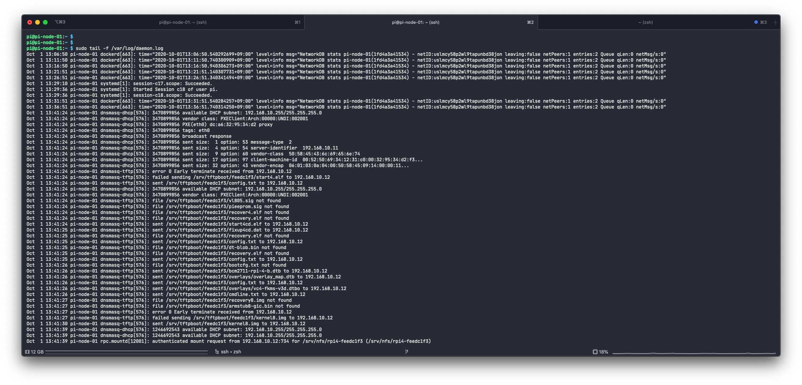

여러대의 라즈베리 파이들로 구성된 도커 스웜 클러스터를 구성하면서 가장 귀찮았던 점은 일일히 여러개의 SD 카드를 플래싱하고 부트 파티션 수정을 통한 ssh 활성화 등 제한적인 헤드리스 설정만 가능한 문제 때문에 직접 파이들에 접속해 추가 설정을 진행해야 했던 점이다. 처음에는 패브릭을 사용해 절반 정도의 자동화를 수행해 봤지만 그래도 중앙화된 관리는 아니라 불편한 점이 여럿 있었고 라즈베리 파이를 늘릴때마다 SD카드를 추가로 구매해야 하는 점도 불만이었다.

추가적으로 여러가지 조사를 해본 결과 라즈베리 파이 4는 SD카드나 기타 USB 스토리지 없이 네트워크 부팅(PXE 부팅)을 수행할 수 있다는 것을 알게 되었다. PXE 부팅을 활성화 하기 위해선 부트로더를 새로 설치하는 과정 등이 필요하긴 하지만 그렇게 어렵지 않다. (참고로 네트워크 부팅은 이더넷 연결을 통해서만 작동한다.)

## PXE 부팅이란?

> PXE: Preboot eXecution Environemnt

PXE란 컴퓨터를 네트워크로 부팅하기 위한 표준이다. DHCP, IP, TFTP등의 프로토콜을 이용하며 네트워크 부팅이 활성화 된 라즈베리 파이 4의 PXE 부팅은 다음의 순서로 이루어진다

* 전원이 인가되면 이더넷 장치를 초기화 한 후 DHCP 요청을 보낸다 (부트로더에 `TFTP_IP`가 고정되어 있으면 DHCP를 사용하지 않고 고정 IP를 사용한다)
* DHCP 서버(라우터 또는 dnsmasq같은 별도의 DHCP 서버)는 부팅 파일을 다운로드할 TFTP 서버 주소를 포함한 DHCP 임대 제안을 응답한다. 
* 파이는 임대 제안에서 가리키는 TFTP 서버에서 부트로더에 설정된 `TFTP_PREFIX` (기본값은 시리얼 넘버지만 변경 가능하다) 디렉토리에서 start*.elf 파일들을 시작으로 커널 등 부팅에 필요한 파일들을 다운로드한다
    * dnsmasq 기준으로 dnsmasq 서버가 192.169.10.11이고 tftp-root가 `/srv/tftpboot` 이면 시리얼 넘버가 `ffffffff` 인 라즈베리 파이는 `192.168.10.11`의 `/srv/tftpboot/ffffff` 디렉토리에서 파일을 다운로드한다
* 다운로드한 파일로 시스템을 부팅하고 루트를 마운트한다. (완전히 디스크 없는 시스템일 경우 NFS를 루트로 마운트할 수 있다.) 

### 클라이언트 라즈베리 파이 설정하기

안타깝께도 한번은 무조건 클라이언트에 접속해서 설정을 해야한다. 원래는 라즈베리 파이 리커버리 모드를 이용해 SD카드 한번만 꽃아주면 자동으로 EEPROM을 수정된 버전의 바이너리로 복구하도록 시도해 보았으나 파일 해시 검증이 리커버리 모드에서 필수적으로 수행되기 때문에 따로 수정힌 버전의 바이너리로 자동으로 복구시키는 것은 불가능했다. 언젠가 네트워크 부팅이 기본값으로 활성화된 공식 리커버리 이미지가 나오기만을 기대할 뿐이다.

### 설정용 SD 카드 만들기

먼저 SD카드에 설정용 OS로 가장 가벼운 Raspbian Lite 이미지를 플래싱한 후 다음의 작업을 수행한다 (또는 그냥 바로 부팅한 후 동일한 작업을 수행해도 무방하다)

* 부트 파티션에 `ssh` 파일을 생성해 ssh를 활성화시킨다 (ex: `touch /mnt/<boot mount point>/ssh`)
* 호스트네임으로 ssh를 연결하기 위해 루트 파티션의 `/etc/hostname`의 내용을 'pi-netboot-setup' 또는 원하는 이름으로 바꾼다 (ex: `echo 'pi-netboot-setup' > /mnt/<root mount point>/etc/hostname`)
* 접속에 사용할 ssh 키를 카피한다 (ex: `cp ~/.ssh/id_rsa.pub > /mnt/<root mount point>/home/pi/.ssh/authorized_keys`)

### 네트워크 부팅 활성화시키기

앞서 만든 SD카드로 클라이언트가 될 라즈베리 파이 4를 부팅하고, 설정한 호스트네임을 사용해 ssh를 접속하자. 

먼저 패키지를 최신으로 업그레이드하고 필수적인 몇가지 패키지를 설치하자 (또는 향후 업데이트에 따라 일부 패키지는 이미 설치되어 있을수도 있다)

```bash
sudo apt update -y
sudo apt upgrade -y
sudo apt full-upgrade -y
sudo apt autoremove -y
sudo apt install vim rpi-eeprom -y
```

2020-09-03 버전 부트로더 기준으로 현재 부팅 순서의 기본값은 SD 부팅 시도 후 USB 대용량 스토리지로 부팅을 시도하는 것을 무한 반복하는 `0xf41` 이지만 혹시라도 미래에 네트워크 부팅이 기본으로 활성화되어 있을수도 있기 때문에 먼저 부트로더 설정을 검사해보는게 좋다

```bash
$ vcgencmd bootloader_config
[all]
BOOT_UART=0
WAKE_ON_GPIO=1
POWER_OFF_ON_HALT=0
DHCP_TIMEOUT=45000
DHCP_REQ_TIMEOUT=4000
TFTP_FILE_TIMEOUT=30000
ENABLE_SELF_UPDATE=1
DISABLE_HDMI=0
BOOT_ORDER=0xf41
```

네트워크 부팅을 활성화하려면 부트로더가 저장된 디렉토리에서 최신 부트로더 (여기선 2020-09-03 버전 사용)를 가져온 다음 설정 파일을 추출해 내야 한다.
```
cp /lib/firmware/raspberrypi/bootloader/stable/pieeprom-2020-09-03.bin pieeprom.bin
rpi-eeprom-config pieeprom.bin > bootconf.txt
```
추출해낸 bootconf.txt를 열어 `BOOT_ORDER` 의 값을 'SD카드에서 부팅을 시도한 다음 네트워크에서 부팅을 시도하고, 이 과정을 무한 반복한다' 를 의미하는 `0xf21`로 변경하자. 기타 부트로더 설정에 대한 자세한 내용은  [Pi 4 Bootloader Configuration - Raspberry Pi Documentation](https://www.raspberrypi.org/documentation/hardware/raspberrypi/bcm2711_bootloader_config.md)를 참고하자
```bash
vim bootconf.txt
```
마지막으로 변경된 설정을 부트로더에 넣은 다음 부트로더를 EEPROM에 설치하면 끝난다. (`-d`옵션은 부트로더 옵션을 새로 설정하는 것을 의미한다.)
```bash
rpi-eeprom-config --out netboot-pieeprom.bin --config bootconf.txt pieeprom.bin
sudo rpi-eeprom-update -d -f ./netboot-pieeprom.bin
```

여기서 만들어진 부트로더는 이 SD카드를 다른 파이에서 부팅했을때도 동일하게 사용할 수 있으므로 여러번 반복할 경우 맨 마지막의 설치만 수행하면 된다. 

네트워크 부팅 서버에 클라이언트를 설정해 주기 위해 시리얼 넘버가 필요하기 때문에 8자리의 영숫자 조합인 시리얼 넘버를 추출한 후 종료하고 파이의 전원을 끄면 클라이언트 설정은 마무리된다.

```bash
$ vcgencmd otp_dump | grep 28: | sed s/.*://g
1234asdf
```

## 부팅 서버 설정하기

나는 서버 또한 라즈베리 파이에 설치했지만 리눅스가 깔린 컴퓨터라면 거의 비슷하게 구성이 가능하다

### 클라이언트 원본 OS 데이터 만들기

여러대의 라즈베리 파이에 동일한 설정을 가진 OS를 배포할 것이기 때문에 원본이 될 OS를 구성해야 한다. 

먼저 필요한 패키지를 설치한 후 원하는 라즈베리 파이 OS 이미지(나는 베타인 64비트 버전을 사용했다.)를 다운로드해 원하는 디렉토리에 마운트하자.

```bash
sudo apt update -y
sudo apt upgrade -y
sudo apt full-upgrade -y
sudo apt autoremove -y
sudo apt install vim unzip kpartx
```
```bash
get -O https://downloads.raspberrypi.org/raspios_lite_arm64/images/raspios_lite_arm64-2020-08-24/2020-08-20-raspios-buster-arm64-lite.zip raspios-buster-arm64-lite.zip
unzip raspios-buster-arm64-lite.zip
kpartx -a -v 2020-08-20-raspios-buster-arm64-lite.img
mkdir {bootmnt,rootmnt}
mount /dev/mapper/loop0p1 bootmnt/
mount /dev/mapper/loop0p2 rootmnt/
```

그 다음 마운트 포인트에서 부트 디렉터리와 루트 디렉터리의 파일들을 꺼내 원본 OS 디렉토리에다가 저장하자

```bash
PI_ROOT=/srv/rpi4root

mkdir -p ${PI_ROOT}
cp -a rootmnt/* ${PI_ROOT}
cp -a bootmnt/* ${PI_ROOT}/boot/
```

라즈베리 파이 펌웨어를 최신 버전으로 교체하자

```bash
rm ${PI_ROOT}/boot/start4.elf
rm ${PI_ROOT}/boot/fixup4.dat
wget https://github.com/Hexxeh/rpi-firmware/raw/stable/start4.elf -P ${PI_ROOT}/boot/
wget https://github.com/Hexxeh/rpi-firmware/raw/stable/fixup4.dat -P ${PI_ROOT}/boot/
```

마지막으로 공통으로 사용할 부분들을 설정하자

* gpu 메모리 설정
* ssh 활성화
* ssh 키 카피 (서버와 동일한 ssh 키를 설정하면 쉽다.)
* fstab 청소
* 타임존 설정
* 기본 패스워드 변경
* 패키지 업데이트 및 필수 패키지 설치

```bash
echo 'gpu_mem=16' >> ${PI_ROOT}/boot/config.txt
touch ${PI_ROOT}/boot/ssh
cp ~/.ssh/authorized_keys > ${PI_ROOT}/home/pi/.ssh/authorized_keys
sed -i /UUID/d ${PI_ROOT}/etc/fstab
sudo chroot ${PI_ROOT} ln -sf /usr/share/zoneinfo/Asia/Seoul /etc/localtime
sudo chroot ${PI_ROOT} passwd pi
sudo chroot ${PI_ROOT} apt update -y
sudo chroot ${PI_ROOT} apt upgrade -y
sudo chroot ${PI_ROOT} apt full-upgrade -y
sudo chroot ${PI_ROOT} apt autoremove -y
sudo chroot ${PI_ROOT} apt install vim -y
```

도커도 미리 설치 가능하다

```bash 
sudo chroot ${PI_ROOT} apt install apt-transport-https ca-certificates curl gnupg-agent software-properties-common -y
curl -fsSL https://download.docker.com/linux/debian/gpg | sudo chroot ${PI_ROOT} sudo apt-key add -
sudo chroot ${PI_ROOT} add-apt-repository "deb [arch=arm64] https://download.docker.com/linux/debian $(lsb_release -cs) stable"
sudo chroot ${PI_ROOT} apt update -y
sudo chroot ${PI_ROOT} apt install docker-ce docker-ce-cli containerd.io
sudo chroot ${PI_ROOT} usermod -aG docker pi
```

만약 Hashicorp Packer를 사용할 줄 안다면 Packer를 사용해 직접 커스텀한 라즈베리 파이 OS 이미지를 만들어낼 수도 있다. [GitHub - solo-io/packer-builder-arm-image: Packer plugin for ARM images](https://github.com/solo-io/packer-builder-arm-image)

### NFS와 TFTP 서버 설정

먼저 필요한 패키지를 설치하자

```bash
sudo apt update -y
sudo apt upgrade -y
sudo apt full-upgrade -y
sudo apt autoremove -y
sudo apt install dnsmasq nfs-kernel-server -y
```

대부분의 경우에는 이미 공유기가 DHCP 서버를 맏고 있기 때문에 dnsmasq를 프록시 모드로 설정하고 TFTP 서빙만 하도록 구성하면 된다.

```bash
sudo tee /etc/dnsmasq.conf << EOF
dhcp-range=192.168.10.255,proxy
log-dhcp
enable-tftp
tftp-root=/srv/tftpboot
pxe-service=0,"Raspberry Pi Boot"
EOF
```

* 내 기준으로 라즈베리 파이들은 192.168.10.0/24 서브넷을 사용하고 있기 때문에 dhcp-range를 서브넷의 브로드캐스트 주소 프록시로 구성했다.
* 라즈베리 파이 부트로더의 `PXE_OPTION43` 기본값이 `"Raspberry Pi Boot"` 이기 때문에 `pxe-service=0,"Raspberry Pi Boot"` 를 설정해줬다.

마지막으로 systemctl로 NFS와 dnsmasq 서비스를 시작해두자.

```bash
sudo systemctl enable dnsmasq
sudo systemctl enable rpcbind
sudo systemctl enable nfs-server
sudo systemctl start dnsmasq
sudo systemctl start rpcbind
sudo systemctl start nfs-server
```


### 클라이언트별 OS 설정하기

기본이 될 원본 OS를 셋업했으면 각 클라이언트에서 찾아갈 경로에 원본 OS를 복사하고 클라이언트별로 약간의 설정을 추가해야 한다. 

클라이언트의 8자리 시리얼 넘버를 사용해 클라이언트의 루트가 될 디렉토리를 만들고 미리 만들어놓은 원본 OS를 복사하자.

```bash
PI_SERIAL=1234asdf

sudo mkdir -p /srv/nfs/rpi4-${PI_SERIAL}
sudo cp -a ${PI_ROOT}/* /srv/nfs/rpi4-${PI_SERIAL}/
```

클라이언트가 TFTP로 처음 부팅 파일을 찾을 디렉토리를 만들고 클라이언트 루트 디렉토리의 boot 디렉토리를 마운트시키자.

```bash
sudo mkdir -p /srv/tftpboot/${PI_SERIAL}
echo "/srv/nfs/rpi4-${PI_SERIAL}/boot /srv/tftpboot/${PI_SERIAL} none defaults,bind 0 0" | sudo tee -a /etc/fstab
sudo mount /srv/tftpboot/${PI_SERIAL}
```

클라이언트 루트 디렉토리에 NFS 공유를 설정하고 부팅 후 해당 디렉토리를 NFS를 통해 루트로 마운트하도록 클라이언트 부트 디렉토리의 cmdlines.txt를 수정하자.

```bash
NFS_SERVER_IP=192.168.10.11

echo "/srv/nfs/rpi4-${PI_SERIAL} *(rw,sync,no_subtree_check,no_root_squash)" | sudo tee -a /etc/exports
sudo tee /srv/nfs/rpi4-${PI_SERIAL}/boot/cmdline.txt <<EOF
console=serial0,115200 console=tty root=/dev/nfs nfsroot=${NFS_SERVER_IP}:/srv/nfs/rpi4-${PI_SERIAL},vers=3 rw ip=dhcp rootwait elevator=deadline
cgroup_enable=cpuset cgroup_enable=memory cgroup_memory=1
EOF
```

필요에 따라 클라이언트가 고정 IP를 가지도록 설정하자

```bash
CLIENT_IP=192.168.10.12
GATEWAY_IP=192.168.10.1

sudo tee -a /srv/nfs/rpi4-${PI_SERIAL}}/etc/dhcpcd.conf <<EOF
interface eth0
static ip_address=${CLIENT_IP}
static routers=${GATEWAY_IP}
static domain_name_servers=${GATEWAY_IP}
EOF
```

끝으로 NFS 공유 설정을 리프레시하자.

```bash
sudo exportfs -ra
```

이제 클라이언트 라즈베리 파이에 전원을 넣으면 클라이언트 라즈베리 파이는 dnsmasq에서 받아온 tftp 서버 정보와 `TFTP_PREFIX` 부트로더 옵션을 조합한 위치에서 부팅에 필요한 파일들을 받아와 시스템을 부팅하고 부팅 파일 중 cmdlines.txt에 명시된 것처럼 NFS를 루트 디렉토리로 마운트하는 과정을 거쳐 부팅된다. 이때 SD카드에서 부팅할 때보다는 부팅 시간이 조금 느릴 수도 있다.

클라이언트 라즈베리 파이가 부팅 파일을 로딩하고 NFS를 마운트하는 것을 보려면 데몬 로그를 테일 한다음 클라이언트 파이의 전원을 넣어 보면 된다.

```bash
sudo tail -f /var/log/daemon.log
```

<div class="Image__Medium">
  
  <figcaption>클라이언트에서 파일을 받아가는 모습</figcaption>
</div>

다른 클라이언트 라즈베리 파이를 설정하려면 본 과정을 클라이언트 별로 반복해 실행하면 된다. 


## 다루지 않았지만 추가적으로 해보면 좋을 내용들

* 클라이언트별 용량 할당: 지금과 같은 구성이라면 클라이언트 파이는 서버의 용량 그대로 자신의 용량으로 인식한다. 디스크 파티션을 쪼개 클라이언트별 루트에 할당해주자. 
  * 클라이언트 루트 디렉토리에 유저별 quota를 적용하는것은 불가능하다. chmod 해버릴 경우 클라이언트에서 볼때는 루트 디렉토리의 권한이 박살난 것처럼 보인다.
* NFS 보안: 클라이언트들의 루트 디렉토리가 어디서든 접근 가능하다. 클라이언트에 고정 IP를 할당해 한 IP가 한 루트만을 마운트할수 있도록 해 보자.
* IaaC: 기본 OS 구성부터 클라이언트별 셋업까지 모두 손으로 진행했다. Packer를 사용해 이미지를 만들고 테라폼, 앤시블, 패브릭같은 도구를 사용해 과정을 자동화 해 보자.
* 부트 파티션은 SD카드에, 루트 파티션은 NFS로 or 부트 파티션은 네트워크에, 루트 파티션은 로컬에: 장점이 뭐가 있는진 모르겠지만 해볼만 한듯 하다.


## 참고 자료

* [Pi 4 Bootloader Configuration - Raspberry Pi Documentation](https://www.raspberrypi.org/documentation/hardware/raspberrypi/bcm2711_bootloader_config.md)
* [The boot folder - Raspberry Pi Documentation](https://www.raspberrypi.org/documentation/configuration/boot_folder.md)
* [Raspberry Pi 4 boot EEPROM - Raspberry Pi Documentation](https://www.raspberrypi.org/documentation/hardware/raspberrypi/booteeprom.md)
* [Two methods to network boot Raspberry Pi 4](https://www.virtuallyghetto.com/2020/07/two-methods-to-network-boot-raspberry-pi-4.html)
* [Raspberry Pi PXE Boot - Netbooting a Pi 4 without an SD card - Linuxhit.com](https://linuxhit.com/raspberry-pi-pxe-boot-netbooting-a-pi-4-without-an-sd-card/)
