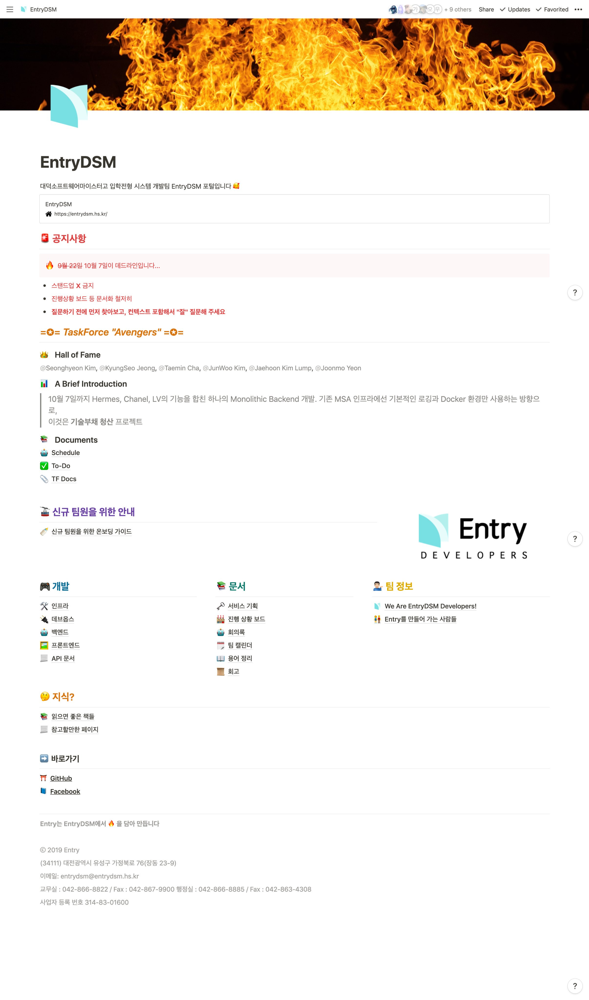

> 며칠 전 민사고에서 만든 민사페이에 대한 글을 읽고 우리도 이렇게 자랑할 만한 시스템이 있는데 하는 생각이 들어 글을 작성하기 시작했다. 

내가 다니던 학교, 대덕 소프트웨어 마이스터고는 몇년동안 `EntryDSM`이라는 온라인 원서 접수 시스템을 운영하고 있다.
원서를 제출하는 학생들은 온라인으로 원서 정보를 입력한 후 만들어지는 원서를 인쇄해 학교로 보내야 하고, 선생님들은 백오피스 툴을 활용해 지원자 정보를 열람하고 관리한다.

이전에는 다른 회사의 솔루션을 사용했던걸로 알고있는데 이게 상상외로 구려서인지 학교 지원을 받아 첫번째로 서비스를 개시한 시점이 아마 2017년도 신입생, 즉 내가 들어올 때였다. 그때는 정말 완전히 도메인 지식도 없고, 디자이너도 없고 하다 보니 퀄리티가 썩 좋지는 않았던 걸로 기억한다.

두번째는 좀 혁신적인걸 도입하기 시작했다.

|K|V|
|-|-|
|백앤드|Node.JS, MongoDB|
|프론트엔드|React, Webpack|

학교 안에서 거의 최초로 리액트를 도입하고, Node.JS를 사용해서 백앤드를 만들었다. 내가 담당한 역할은 백오피스 툴의 일부였다. (Promise 떡칠이 된 대시보드인데 다시는 보고싶지 않은 코드 중 하나다.) 
 
놀랍게도 TLS도 적용이 안되었고 버그 투성이였는데도 큰 문제가 없었다.

그러나 안정적인건 아니였기 때문에 또(...) 갈아엎었다.

|K|V|
|-|-|
|메인 백앤드|Springboot, MySQL|
|백오피스 백앤드|Flask, MySQL|
|프론트엔드|Vue, Vue-CLI|

세번째로 만들었을때는 괄목할 만할 변화가 있었다. 바로 *디자인* 이라는 것을 하기 시작했다. 
놀랍게도 첫번째 두번째는 디자인이라는게 아예 존재하지도 않았다. 
 
> 지금은 카카오에서 일하고 계신 디자이너님에게 그랜절을... (네번째 버전에서도 쓰고있습니다..!)

그러나 이것도 완벽하지 못했다. 메인 백앤드를 2기 선배 혼자서 Springboot로 만들었는데 나 포함 3기들은 주력으로 Python에 Flask나 Sanic을 밀고 있었기 때문에 **아무도** 자바로 백앤드를 할 줄 몰라서 유지보수하는게 불가능했다.
 
거기다가 매년 해결되지 않는 `마감 주도 개발`은 결국 또 해결이 안되서 결국 프론트엔드, 백앤드를 막론하고 끝내주게 맛있는 스파게티가 완성이 되었고 결국 네번째도 갈아엎기로 했다. 그래도 이번엔 다행히 학교에서 TLS 인증서를 지원받아서 보안 문제에는 조금 진척이 있었다.

그렇게 어영부영 2019년을 맞이했고 내 기수가 주도하는 네번째 버전을 만들게 되었다.

## Hype Driven Development
2학년 겨울방학에 인턴을 다녀온 뒤 한창 MSA 뽕에 빠진 나는 기술부채가 도사리고 있다는 것을 전혀 모른 채 호기롭게 MSA 도입을 주장했고, 회의를 거쳐 해볼만하겠다는 결론이 나서 결국 MSA를 시작하게 되었다. 

MSA를 뒷받침하는 인프라를 만드려고 단 하나뿐인 서버에 온갖 도구를 깔기 시작했다. Travis CI를 사용해 만드는 도커 이미지를 저장하기 위해 레지스트리를 띄우고, 도커 이미지로 말린 서비스들을 띄우기 위해 Docker Swarm을 사용하고, 모니터링을 위해 Filebeat와 ELK를 사용하며 보안정보 관리를 위해 Hashicorp Vault까지 사용했다. 다행히 서버가 꽤 고성능이라 서버 한대로 아직까지는 잘 버티고 있다.

핵심 서비스를 인중, 유저정보, 원서정보, 어드민 이렇게 4개로 쪼개어 개발하기 시작했다.

그리고 인프라와의 연결을 위해 나는 자동으로 Filebeat가 바라보고 있는 파일에 JSON 형태로 로그를 쌓고 문제가 있다면 Traceback을 자동으로 슬랙으로 쏴주는 로깅 툴을 만들었고, 다른 친구는 자동으로 레지스트리에 이미지가 푸쉬되면 서버에 돌아가고 있는 이미지를 업데이트 해주는 Watchdog을 만들기도 하는등 본격적으로 오버 엔지니어링 테크를 타기 시작했다. 

그래도 나름 내 기수가 떠나면 후배들이 이걸 100% 숙지하고 서비스를 유지할 수 있을거라는 확신은 없어서 노션을 사용해 위키를 작성하기도 했다.

나는 모두가 동일하게 MSA 서비스를 만들수 있겠지라는 그런 근거없는 신념을 가지고 내가 맡은 서비스를 알아서 개발했고, 2학기가 가까워 가면서 번아웃도 오고 취업 준비도 하느라 내 관심에서 멀어져 갔다.

## 쌓여만 가는 기술부채

우리학교에선 사실상 3학년 2학기부터는 회사를 다니는 사람들이 많아 많은 사람이 학교를 빠져나간다. 우리 개발팀도 그랬고, 결국 개발자 중 남은건 2학년들뿐이었다. 결국 기존 인프라에 대한 교육도 덜 되었고 

## 아 망했어요

평화롭게 회사에서 일을 하고 있던 어느날 평화롭지 않은 소식, 즉 일정을 맞춰서 못만들것같아 전국 모든 학교의 입학 일정을 미루는 유니크한 경험을 해볼것 같다는 소식을 들어 긴급하게 태스크포스를 꾸려야 한다는 결론에 도달했다. 도저히 MSA 를 유지할수가 없었기 때문이었다. 

(대충 아다리 안맞아서 안될것 같았다는 뜻)

그래서 결국 메인 기능을 개발하는 나와 다른 한 친구가 MSA 다 걷어내고 하나의 모놀리틱 서버로 "Avengers to save Entry in crisis" 라는 거창한 타이틀을 가진 어벤저스란 이름의 태스크포스를 꾸려서 일주일동안 각자 일정부분을 개발한 후 10월 5일에 만나 정말 단 하루만에 모든걸 끝냈다. 

그리고 사상 최대의 생산성을 기록하기도 했다. (정말 하루종일 코드만 짰다. 회사에서도 이정도는 못내는데...)

## 왜 망했지?

사실 팀원 모두가 MSA 아키텍처에 대한 준비가 안되