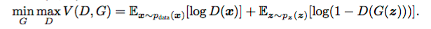
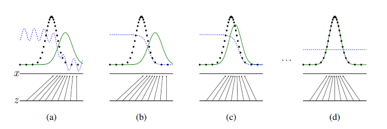
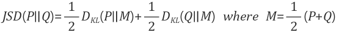

## 1. GAN이란?
머신러닝은 크게 세가지 분류로 나누어진다. 첫번째는 지도학습(Supervised Learning), 두번째는 강화학습(Reinforcement learning)그리고 마지막은 비지도 학습(Unsupervised Learning)이다. 
GAN은 이 중에서 비지도 학습에 속하며 2014년 NIPS에서 Ian Goodfellow가 발표한 생성 모델으로써 Yann Lecun 교수님이  근10년 안에 나온 딥러닝 아이디어 중 가장 최고라는 말을 했을 정도로 유명한 생성 모델이다. 

## 2. GAN의 구조와 원리
GAN의 원리를 설명하려면 GAN의 구조를 알아야 한다. GAN은 분류를 담당하는 판별자 D(Discriminator), 그리고 랜덤한 노이즈에서 데이터를 만들어 내는 생성자 G(Generator)의 두개의 모델로 구성되어 있다.

이 두 모델은 GAN이라는 이름에서 쉽게 알수 있다. "Generative Adversarial Network" 이 이름을 풀어보자면 생성하며 대립하는 네트워크. 즉, 생성자 G와 판별자 D가 대립하며 서로의 성능을 개선시켜 나가는 모델이며 논문에서 언급한 예시를 따르자면 경찰과 지폐 위조범의 대립같은 방식이라고 한다. 

> 지폐위조범(Generator)은 경찰을 최대한 열심히 속이려고 하고 다른 한편에서는 경찰(Discriminator)이 이렇게 위조된 지폐를 진짜와 감별하려고(Classify) 노력한다. 이런 경쟁 속에서 두 그룹 모두 속이고 구별하는 서로의 능력이 발전하게 되고 결과적으로는 진짜 지폐와 위조 지폐를 구별할 수 없을 정도(구별할 확률 pd=0.5)에 이른다는 것.

다시 말해 판별자는 원 데이터만을 참으로 판단하기 위해 노력하고 생성자는 판별자가 거짓으로 판별하지 못하도록 가짜 데이터를 생성해 가며 두 모델의 성능이 같이 올라가게 되고 최종적으로는 판별자가 실 데이터와 가짜 데이터를 구분하지 못하게 된다. 

조금 더 수학적으로 설명하자면 생성자 G는 원 데이터의 확률분포를 알아내려 노력하고 분포를 재현하여 실 데이터와 차이가 없도록 하고 판별자 D는 판별 대상인 데이터가 실 데이터인지, G가 만들어낸 데이터인지 구별하여 각각에 대한 확률을 추정한다는 것이다

좀 더 자세하게 설명하기 위해 GAN의 수식을 살펴보자,

먼저 D가 V(D, G)를 최대화 하는 관점에서 보면 x~pdata(x)는 실 데이터의 확률분포이고 x는 그 중 샘플링한 데이터이다.  판별자 D는 출력이 실 데이터가 들어오면 1에 가깝게 확률을 추정하고, G가 만들어낸 가짜 데이터가 들어오면 0에 가깝게 한다. 따라서 log를 사용했기 때문에 실 데이터라면 log 1, 즉 최댓값인 0에 가까운 값이 나오고  가짜 데이터라면  으로 발산하게 되기 때문에 V(D, G)를 최대화 하는 방향으로 학습하게 된다.

이제 G 부분인 오른쪽 부분이 V(D, G)를 최소화 하는 관점에서 살펴보자. z~pz(z)는 보통 정규분포로 사용하는 임의의 노이즈 분포이고 z는 노이즈 분포에서 샘플링한 임의의 코드이다.

그리고 이 입력을  생성자 G에 넣어 만든 데이터를 판별자 D가 속아 넘어가서 진짜로 판별되면 log(1- D(G(z)))이기 때문에 D(G(z))이 1이며 으로 발산하고 판별자를 속이지 못하면 D(G(z))는 0이기 때문에 log(1- D(G(z))) 는 0에 가까운 최댓값이 나오게 될 것이다. 따라서 G는 V(D, G)를 최소화 하는 방향으로 학습하게 된다

즉 V(D, G)에 있어서 G는 이를 최소화 하는 방향으로, D는 최대화 하는 방향으로 가게 하는 minimax Problem이라는 것이다. 

## 3. GAN의 학습
위에서 보았듰이 GAN의 생성자 G는 원 데이터의 확률 분포와 비슷한 데이터를 만들어 내어 판별자D를 속이는 것이 목표이다. 그렇다면 GAN의 D와 G는 어떻게 학습을 진행할까?

확률분포라는 것에 집중해 보자. D는 G가 기존 확률 분포와 얼마나 다른지 판별한다. G는 기존 확률분포에 맞추어서 D를 속이기 위해 생성 모델을 수정해 나간다. 

여기서 아이디어를 얻을 수 있다. 바로 V(D, G)를 minimax 하는 과정이 G가 만드는 확률분포와 원 데이터의 확률분포의 차이를 줄여가는 과정이라는 것이다. 우리는 확률분포간의 차이를 계산하기 위해 JSD(Jensen–Shannon divergence)를 사용한다 JSD는 두 확률 분포사이의 차이를 계산하는 것이다 JSD를 먼저 알아보기 위해서는 KLD(Kullback–Leibler divergence)를 알 필요가 있다. KLD를 모른다면 KLD 정리 글을 먼저 살펴보자.

JSD는 다음과 같이 두개의 KLD를 이용해 이루어 진다. 

간단히 설명하자면 JSD는 원 확률분포와 원 확률분포와 G의 확률분포를 KLD 한 값과 G의 확률분포와  원 확률분포와 G의 확률분포를 KLD 한 값의 평균을 구하여 두 확률분포간의 차이를 구하는 것이다.

이와 같은 발산을 통해 원 데이터의 확률분포와 G가 생성해낸 확률분포간의 JSD가 0이 되면 두 분포간의 차이가 없다는 것이므로 학습이 완료되었다는 것이다.

## REFERENCE
https://blog.naver.com/leesoo9297

https://www.youtube.com/watch?v=odpjk7_tGY0&feature=youtu.be

http://jaejunyoo.blogspot.com/2017/01/generative-adversarial-nets-2.html

http://jaejunyoo.blogspot.com/2017/01/generative-adversarial-nets-1.html

http://mafams.tistory.com/10

https://en.wikipedia.org/wiki/Jensen%E2%80%93Shannon_divergence