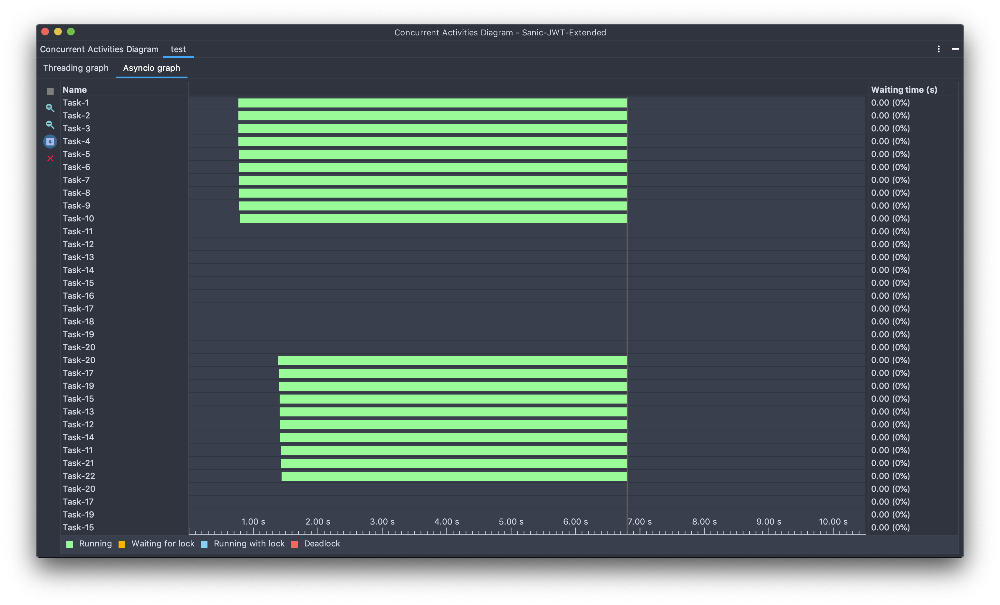
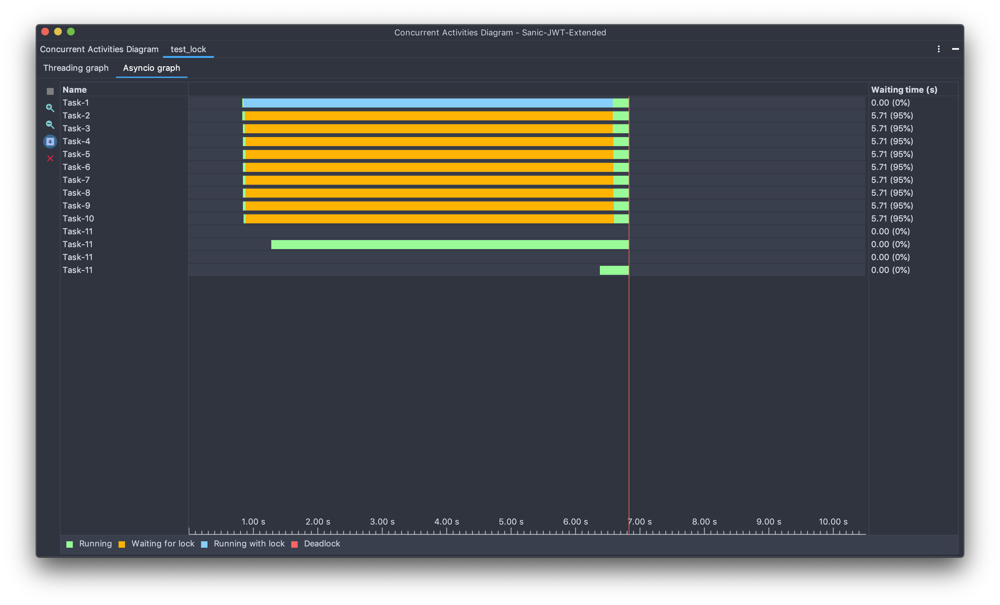
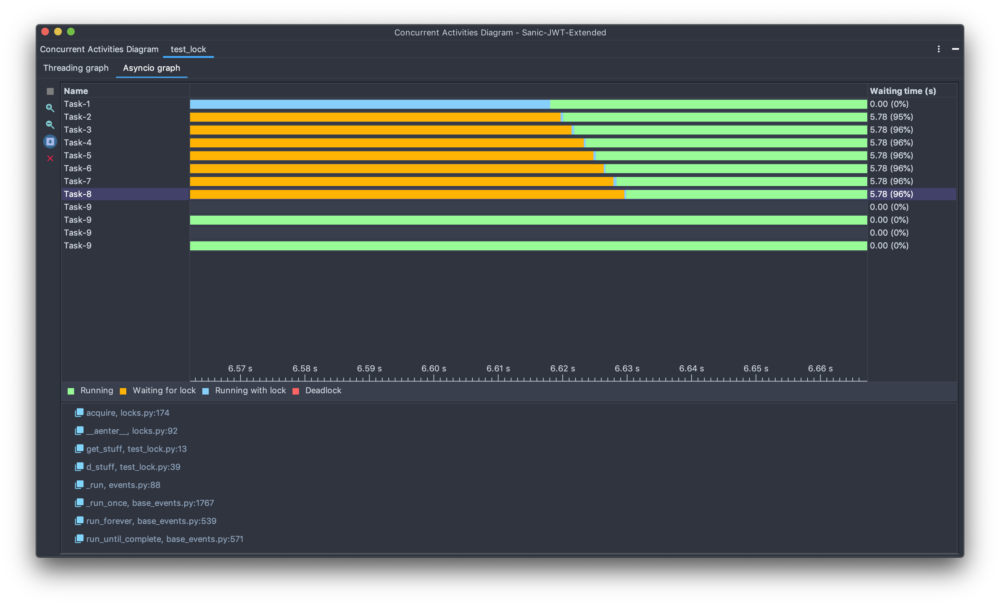
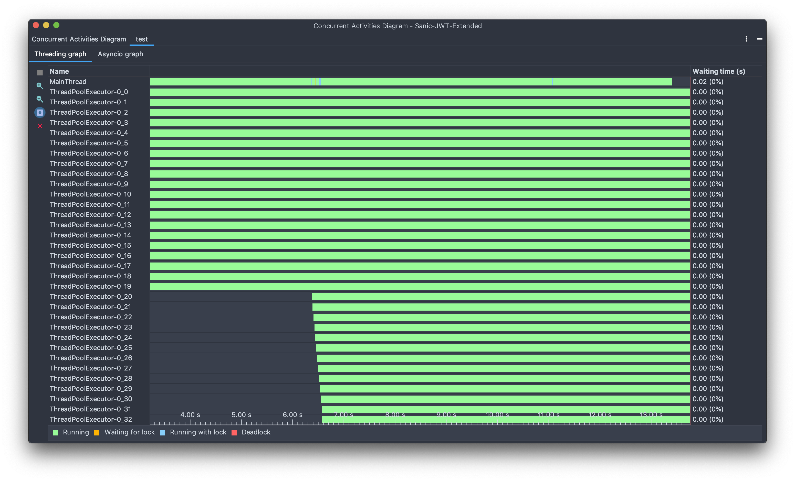
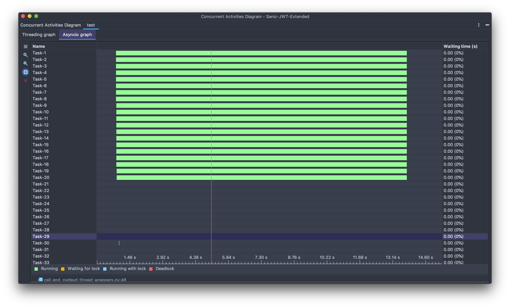
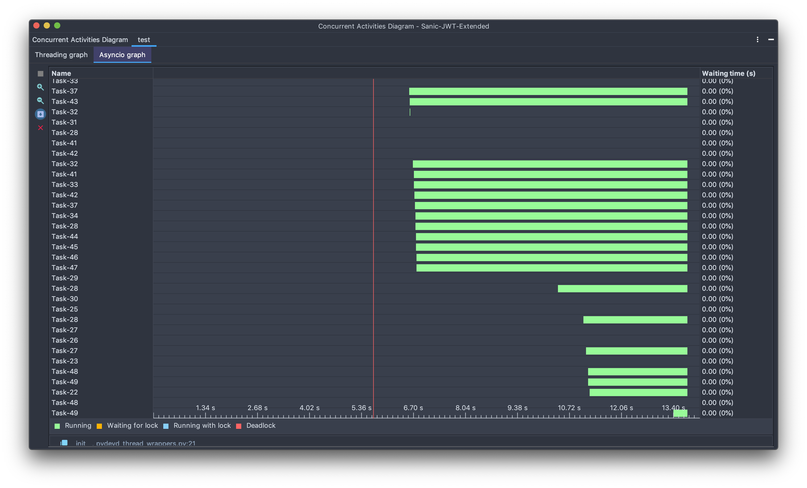
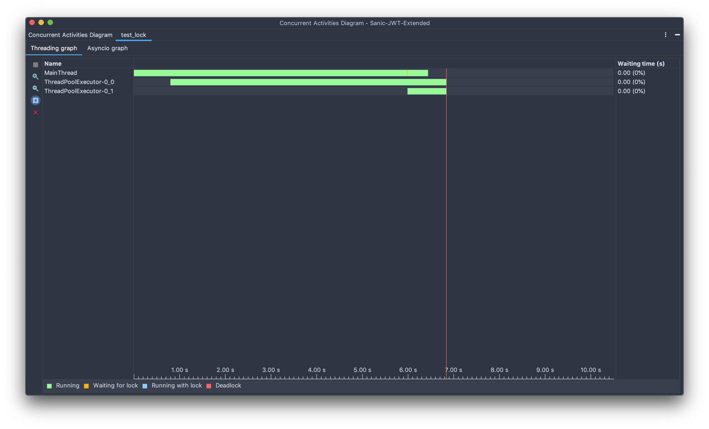
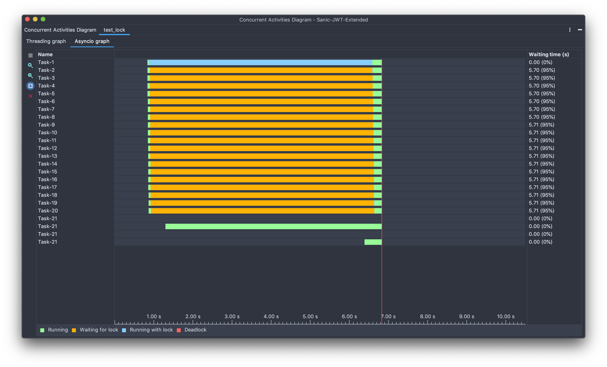

> 이 글은 [what's Python asyncio.Lock() for?](https://stackoverflow.com/questions/25799576/whats-python-asyncio-lock-for) 라는 스택오버플로우 질문에 달린 [dano](https://stackoverflow.com/users/2073595/dano)라는 분의 답변을 기초로 하여 작성되었습니다.

파이썬 asyncio 문서를 찾아보다 보면 [동기화 프리미티브](https://docs.python.org/ko/3/library/asyncio-sync.html) 라는 장이 존재한다. 이 장에는 asyncio가 동시성을 통제하기 위해 제공하는 여러가지 동기화 프리미티브(스레딩 모듈의 것과 상당히 유사하다)가 소개되어 있는데 그 중 당당히 적혀있는 `asyncio.Lock`이 보일 것이다.

그리고 설명에는 다음과 같이 적혀있다.

> asyncio 태스크를 위한 뮤텍스 록을 구현합니다.

뮤텍스 락? 생각하는 것처럼 멀티스레딩에서 자원 잠금을 사용할때 쓰는 그 뮤텍스 락이다.

asyncio는 싱글 스레드로 돌아가는데 무슨 락이 필요하냐고 생각할 수도 있지만 멀티스레딩 코드에서 락을 사용하는 이유와 동일하게 자원 보호를 위해 락을 사용한다.

asyncio는 기본적으로 싱글스레드로 돌아가지만 우리가 `await` 할때 동시 실행이 발생하게 되는 경우가 있다.

## 백문이 불여일견, 직접 락을 걸어 봅시다.

웹 서버에서 데이터를 가지고 와 전역 변수에 캐시하는 async 함수를 만들어 보자.

```python
async def request():
    global cache

    url = "http://slowwly.robertomurray.co.uk/delay/4600/url/http://example.com"

    if url in cache:
        return cache[url]

    async with aiohttp.ClientSession() as session:
        async with session.get(url) as resp:
            cache[url] = await resp.text()

    return cache[url]
```

그리고 이 함수로 코루틴을 대략 10개 만들고 `asyncio.gather`를 통해 동시 실행해보자.

```python
tasks = [request() for i in range(10)]


loop = asyncio.get_event_loop()
loop.run_until_complete(asyncio.gather(*tasks))
```

PyCharm의 `Concurrency Diagram`의 기능으로 살펴본 결과는 다음과 같다.


모든 코루틴이 각기 새로운 HTTP 세션을 만들고 요청을 하고 있다. 같은 URL에 동시에 요청을 하는데 각자 따로 비용을 들여 따로 가져오는 것은 비용 낭비라고 할 수 있다. 거기다가 우리가 사용하려 하는 캐시를 전혀 쓰지 않을 뿐더러 계속해서 캐시를 덮어쓰고 있다.

여기다가 request 함수에 락을 추가해 보자.

```python
lock = asyncio.Lock()

async def request():
    global cache, lock
    url = "http://slowwly.robertomurray.co.uk/delay/4600/url/http://example.com"

    async with lock:
        if url in cache:
            return cache[url]

        async with aiohttp.ClientSession() as session:
            async with session.get(url) as resp:
                cache[url] = await resp.text()

        return cache[url]
```

실행한 결과는 다음과 같다.



아까 전과는 다르게 첫번째 코루틴이 HTTP 요청을 하는 동안 나머지 코루틴은 락을 대기하면서 멈춰 있다.



끝부분을 확대해 보면 이렇게 보이는데, 첫번째 HTTP 요청으로 인해 걸리는 긴 락이 풀리면 각 코루틴이 찰나의 순간에 락을 걸고 새로 요청하는것이 아니라 캐시된 결과를 가져오고 락을 푸는 것을 볼 수 있다.

## 생각보단 별로인것 같은데요?

네트워크를 사용하는 비용은 1/10으로 줄였지만 아직까지 실행시간의 차이는 많이 나지 않는다. 이걸 보고 `프로그래머가 컴퓨터보다 비싸니 이정도는~ ㅎㅎ` 할 수도 있지만 동시 실행되는 코루틴이 많아질 수록 차이는 극대화된다.

대충 동시 실행되는 코루틴을 ~~200개~~20개 정도로 늘려보자. (컴퓨터 성능이 된다면 200개를 동시에 돌려보면 더 확실한 차이를 경험할 수 있을것이다.)

aiohttp는 내부적으로 스레드풀을 쓰는데 컴퓨터가 동시에 돌릴 수 있는 스레드에는 한계가 있기 때문에 동시에 돌릴 수 있는 스레드 개수를 넘는 코루틴을 동사에 실행시키려 하면 병목이 생기며 실행시간이 확 늘어나게 된다.

락을 쓰지 않고 20개 코루틴을 동시에 실행할 경우의 스레드와 asyncio 그래프다






실행되는 스레드는 **30개**를 넘고 aiohttp가 만든 태스크로 인해 스크롤을 내려야만 다 확인할 수 있으며 실행시간은 약 두배인 **13.4초**정도가 걸렸다. (여러번 실행해 봤는데 가끔은 15초를 넘어갈 때도 있었다.)

락을 건 코드는 어떨까?




하지만 락을 쓰면 처음 한번만 요청하고 캐시한 후 이후에는 캐시한 값을 가져오기 때문에 aiohttp가 사용하는 스레드는 훨신 적어지고 캐시된 값을 사용하게 되어 자원을 확실히 절약하는 것을 다시 한번 확인할 수 있다.

## 하지만... 이건 너무 인위적이지 않나요?

물론 이 예제가 상당히 인위적인 상황이라고 생각할 수도 있다.

하지만 이 예제와 비슷하게 데이터베이스 커넥션 풀을 생성하는 경우에도 동일하게 락의 효과를 확실하게 경험할 수 있다.

데이터베이스에서 수십가지의 값을 동시에 가져오려고 하는데 코루틴이 실행될 때 마다 데이터베이스 커넥션 풀을 매번 새로 만든다면(이 예제에서는 매번 요청을 하면) 자원 낭비가 정말로 심각할 것이다. (이건 HTTP 요청보다도 비싼 작업이다!) 이때 커넥션 풀을 생성하는 부분에 락을 걸고 커넥션 풀을 저장하여 사용한다면(마찬가지로 이 예제에서는 응답을 캐시해 두면) 자원을 훨씬 절약할 수 있을 것이다.

## TL; DR, show me the code.

without lock

```python
import aiohttp
import asyncio


cache = dict()
lock = asyncio.Lock()


async def request():
    global cache, lock
    url = "http://slowwly.robertomurray.co.uk/delay/4600/url/http://example.com"

    if url in cache:
        return cache[url]

    async with aiohttp.ClientSession() as session:
        async with session.get(url) as resp:
            cache[url] = await resp.text()

    return cache[url]


tasks = [request() for i in range(20)]


loop = asyncio.get_event_loop()
loop.run_until_complete(asyncio.gather(*tasks))
```

with lock

```python
import aiohttp
import asyncio


cache = dict()
lock = asyncio.Lock()


async def request():
    global cache, lock
    url = "http://slowwly.robertomurray.co.uk/delay/4600/url/http://example.com"

    async with lock:
        if url in cache:
            return cache[url]

        async with aiohttp.ClientSession() as session:
            async with session.get(url) as resp:
                cache[url] = await resp.text()

        return cache[url]


tasks = [request() for i in range(20)]

loop = asyncio.get_event_loop()
loop.run_until_complete(asyncio.gather(*tasks))
```
